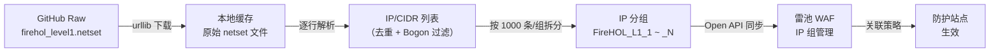

# 通过雷池 Open API 接入 FireHOL 公开威胁情报

雷池（SafeLine）社区版内置了 T-Sec 语义分析引擎，对 SQL 注入、XSS、命令注入等结构化攻击具备成熟的检出能力。在 IP 威胁情报层面，社区版同样提供了一套基础的 **IP 威胁情报库**，管理员可通过管理面板手动维护黑/白名单 IP 组，作为语义引擎之外的辅助拦截手段。

社区版不包含专业版与商业版中的配置同步与加强情报，然而，IP 组的创建、更新、删除等操作可以通过雷池的 Open API 操作，这意味着所有对 IP 威胁情报的自动化管理可以以 API 调用为入口，为社区用户自行接入外部威胁情报源提供了完整的可编程接口。

互联网上存在多个高质量、低误报的公开威胁情报源。其中 **FireHOL Level 1** 是被广泛认可的"入门级"IP 黑名单——它汇聚了 DShield、Feodo、Spamhaus DROP/EDROP 等多个权威数据源，专门为面向互联网的服务器防火墙设计，误报率极低。

本文将详细拆解一套基于 Python 的自动化脚本，它通过雷池 Open API 将 FireHOL Level 1 的威胁情报定期同步至雷池 IP 组中，以极低的运维成本显著扩展社区版的 IP 信誉防御纵深。

---

## 一、FireHOL Level 1 是什么？

FireHOL 是一个 Linux 防火墙配置工具，其维护的 [blocklist-ipsets](https://github.com/firehol/blocklist-ipsets) 项目则是一组独立的 IP 黑名单合集。其中 **Level 1** 的设计哲学是：

> *"用最低的误报率换取最大程度的保护，适合所有面向互联网的服务器、路由器和防火墙。"*

| 特性               | 说明                                                                                       |
| :----------------- | :----------------------------------------------------------------------------------------- |
| **数据来源** | DShield、Feodo、Spamhaus DROP/EDROP、FullBogons 等                                         |
| **更新频率** | 每 1 分钟自动更新                                                                          |
| **典型规模** | ~3,800–3,900 个子网（覆盖约 6 亿个独立 IP）                                               |
| **格式**     | 纯文本，每行一个 CIDR 或单 IP                                                              |
| **获取地址** | `https://raw.githubusercontent.com/ktsaou/blocklist-ipsets/master/firehol_level1.netset` |

FireHOL 还提供 Level 2–4，攻击覆盖范围递增但误报率也随之上升。**Level 1 是最保守、最适合生产环境的选择**——作为基础防火墙规则直接部署，几乎不存在误封合法用户的风险。

---

## 二、整体架构：一条自动化情报管线

整个方案的运作逻辑可以用一条线性流水线描述：



关键设计决策：

1. **每组上限 1000 条**：雷池社区版对单个 IP 组有容量限制（实测约 1000 条），因此必须拆分。
2. **全量覆盖更新**（PUT，而非增量 append）：FireHOL 会定期移除不再活跃的恶意 IP，增量追加会导致过期数据堆积。
3. **过滤 Bogon 地址**：私有地址（10.0.0.0/8、192.168.0.0/16 等）、回环地址等不应出现在公网入站流量中，在 WAF 层拦截没有意义——这些应该由边界防火墙（iptables/nftables）处理。

---

## 三、脚本核心逻辑深度拆解

> 完整脚本约 650 行，以下按功能模块拆解。

### 3.1 下载与本地缓存

```python
def fetch_firehol_level1() -> str:
    req = Request(
        FIREHOL_URL,
        headers={"User-Agent": "FireHOL-Sync/1.0"},
    )
    with urlopen(req, timeout=60) as resp:
        data = resp.read().decode("utf-8")

    raw_path = os.path.join(WORK_DIR, "firehol_level1.netset")
    with open(raw_path, "w", encoding="utf-8") as f:
        f.write(data)
    return data
```

这里选择了 `urllib.request` 而非 `requests` 库，原因在于职责分离。脚本中 `SafelineClient` 依赖 `requests` 处理 API 交互（需要 Session 管理、SSL 忽略等特性），而简单的 HTTP 文件下载完全可以用标准库完成，不必为此引入额外依赖——`urllib` 在这一场景下功能完全等价且无需 `pip install`。下载的内容同时保存到本地工作目录作为缓存，这样即使网络故障或 FireHOL 源临时不可达，也能从缓存中回溯上次拉取的数据。

FireHOL 的原始文件是标准的 ipset `.netset` 格式，包含大量以 `#` 开头的注释行（元数据、更新时间、条目统计等）。脚本在下一步解析中有针对性地跳过这些行。

### 3.2 解析与 Bogon 过滤

```python
BOGON_NETS = {
    "0.0.0.0/8",       # "This host on this network" (RFC 1122)
    "10.0.0.0/8",      # Private-Use (RFC 1918)
    "100.64.0.0/10",   # Carrier-Grade NAT (RFC 6598)
    "127.0.0.0/8",     # Loopback (RFC 1122)
    "169.254.0.0/16",  # Link Local (RFC 3927)
    "172.16.0.0/12",   # Private-Use (RFC 1918)
    "192.0.0.0/24",    # IETF Protocol Assignments (RFC 6890)
    "192.0.2.0/24",    # TEST-NET-1 (RFC 5737)
    "192.168.0.0/16",  # Private-Use (RFC 1918)
    "198.18.0.0/15",   # Benchmarking (RFC 2544)
    "198.51.100.0/24", # TEST-NET-2 (RFC 5737)
    "203.0.113.0/24",  # TEST-NET-3 (RFC 5737)
    "224.0.0.0/3",     # Multicast + Reserved
}

def is_bogon(ip_str: str) -> bool:
    for bogon in BOGON_NETS:
        if ip_str.startswith(bogon):
            return True
    return False
```

这段代码需要仔细审视。`is_bogon()` 使用的是字符串前缀匹配，而非真正的 IP 子网归属计算。例如：

- `"10.0.0.0/8".startswith("10.0.0.0/8")` → `True` ✓
- `"10.1.2.0/24".startswith("10.0.0.0/8")` → `False` ✗ （本应匹配）

这意味着**只能精确匹配到 BOGON_NETS 中完全相同的 CIDR 条目**，而不能识别子网划分。这里有意简化了实现——代码注释中明确写道"更精确的实现需要 IP 地址数学库（如 `ipaddress`），但简单匹配在此场景下完全足够"。实际上，FireHOL Level 1 自身已经在源头过滤了 Bogon 地址，`is_bogon()` 在此扮演的是一道额外安全网的角色：万一下游数据被污染，它能兜底拦截 BOGON_NETS 中列出的精确 CIDR。在定制场景中接入更广泛的 IP 源时，建议改用 `ipaddress.IPv4Network` 做真正的子网包含判断。

```python
def parse_firehol(text: str, skip_bogons: bool = True) -> list:
    ips = []
    seen = set()
    for line in text.splitlines():
        line = line.strip()
        if not line or line.startswith("#"):
            continue
        if line in seen:
            continue
        if skip_bogons and is_bogon(line):
            continue
        seen.add(line)
        ips.append(line)
    return ips
```

解析逻辑简洁高效：跳过空行和注释 → 去重（`seen` 集） → 可选 Bogon 过滤 → 保持原始顺序输出。使用 `set` 做去重是 O(1) 均摊时间复杂度，对于约 4000 条记录的规模完全不是瓶颈。

### 3.3 IP 分组拆分

```python
def split_into_groups(ips: list, max_per_group: int) -> list:
    groups = []
    for i in range(0, len(ips), max_per_group):
        groups.append(ips[i : i + max_per_group])
    return groups
```

这里选择了最简单也最可靠的切片策略。之所以不做更"智能"的分组——比如按地理区域或 ASN 聚合——是因为对于 WAF 层的 IP 阻断而言，IP 组的划分方式本身不影响拦截效果，真正影响拦截的是最终关联到站点的 IP 组集合。而简洁的等量分片带来了两个关键收益：组数和命名完全可预测（`FireHOL_L1_1`、`FireHOL_L1_2`…），这对于后续同步逻辑中的"删除多余旧组"步骤至关重要——任何不在预期命名列表中的旧组都可以被安全清理。

### 3.4 SafelineClient —— 雷池 Open API 的 Python 封装

这是整个脚本中代码量最大的部分，也是客户端封装的核心所在。雷池的 Open API 使用统一的认证和响应格式，脚本在此基础上构建了一个完整的客户端层。

**认证与会话管理**：

```python
class SafelineClient:
    def __init__(self, base_url: str, token: str):
        self.base_url = base_url.rstrip("/")
        self.session = requests.Session()
        self.session.headers.update({
            "X-SLCE-API-TOKEN": token,
            "Content-Type": "application/json",
            "Accept": "application/json",
        })
        self.session.verify = False  # 自签名证书
```

雷池管理端口（默认 9443）使用自签名 TLS 证书，因此必须禁用 SSL 验证（`verify=False`）。生产环境中如果配置了有效证书，可以移除此行。认证通过自定义 HTTP 头 `X-SLCE-API-TOKEN` 传递——这个 Token 在雷池管理后台的「系统设置 → API Token」中生成，要求雷池版本 ≥ 6.6.0。

**统一请求处理与响应解包**：

```python
def _request(self, method: str, path: str, **kwargs) -> dict:
    url = f"{self.base_url}{path}"
    kwargs.setdefault("timeout", API_TIMEOUT)
    resp = self.session.request(method, url, **kwargs)

    # ... 错误处理：ConnectionError, Timeout, 401, 403, JSON 解析失败 ...

    data = resp.json()
    # 雷池 API 响应统一包装：
    # {"data": ..., "err": ..., "msg": ...}
    if isinstance(data, dict) and "data" in data and "err" in data:
        wrapped = data.get("data")
        if wrapped is not None:
            return wrapped
    return data
```

这是整个客户端最重要的设计：**响应体自动解包**。雷池所有 Open API 的响应都遵循统一的三段式结构：

```json
{
  "err": null,       // 错误码，null 表示成功
  "data": { ... },   // 实际返回数据
  "msg": null        // 错误或提示信息
}
```

`_request()` 方法在检测到这种结构后，会自动提取 `data` 字段返回给上层调用者。这意味着所有便捷方法（`list_ip_groups`、`create_ip_group` 等）拿到的直接就是业务数据，无需再手动解包一层。将响应解包的样板代码下沉到统一的 `_request()` 中，避免了在每个便捷方法里重复相同的 `data.get("data")` 逻辑——当 API 版本升级导致响应格式微调时，只需修改一处。

**API 方法映射**：

| 方法                                     | HTTP   | 端点                                 | 说明                                                       |
| :--------------------------------------- | :----- | :----------------------------------- | :--------------------------------------------------------- |
| `list_ip_groups()`                     | GET    | `/api/open/ipgroup`                | 获取所有 IP 组列表，响应为`{"nodes": [...], "total": N}` |
| `get_ip_group_detail(id)`              | GET    | `/api/open/ipgroup/detail?id={id}` | 获取单个 IP 组详情                                         |
| `create_ip_group(comment, ips)`        | POST   | `/api/open/ipgroup`                | 创建新 IP 组，返回新组 ID                                  |
| `update_ip_group(id, comment, ips)`    | PUT    | `/api/open/ipgroup`                | **全量覆盖**更新 IP 组                               |
| `append_ips_to_groups(group_ids, ips)` | POST   | `/api/open/ipgroup/append`         | **增量追加** IP 到已有组                             |
| `delete_ip_groups(group_ids)`          | DELETE | `/api/open/ipgroup`                | 批量删除 IP 组，请求体`{"ids": [...]}`                   |
| `health_check()`                       | GET    | `/api/open/ipgroup?top=1`          | API 连通性探测                                             |

这里有一个重要的 API 语义区分：

- **PUT `/api/open/ipgroup`** 是**全量覆盖**：传入的 `ips` 数组将完全替换该组的现有 IP 列表，不再存在于新列表中的 IP 会被移除。
- **POST `/api/open/ipgroup/append`** 是**增量追加**：只添加新 IP，不影响已有 IP。

脚本在同步现有组时使用的是 **PUT（全量覆盖）**，这确保了每次同步后雷池中的 IP 组与 FireHOL 当前数据完全一致。FireHOL 会持续淘汰已失效的攻击源 IP，如果使用增量追加，这些过期条目将永远残留在雷池中。

### 3.5 核心同步算法

```python
def sync_groups(client: SafelineClient, groups: list, prefix: str):
    # Step 1: 获取雷池中所有现有 IP 组
    existing_groups = client.list_ip_groups()

    # Step 2: 筛出已有 FireHOL 前缀的组
    old_firehol = {
        g["comment"]: g
        for g in existing_groups
        if g.get("comment", "").startswith(prefix)
    }

    # Step 3: 删除多余的旧组（不在当前期望列表中的）
    expected_names = [f"{prefix}_{i+1}" for i in range(len(groups))]
    to_delete_ids = [
        g["id"] for name, g in old_firehol.items()
        if name not in expected_names
    ]
    client.delete_ip_groups(to_delete_ids)

    # Step 4: 对每组：已存在则更新，不存在则创建
    for i, ip_list in enumerate(groups):
        group_name = expected_names[i]
        existing = old_firehol.get(group_name)
        if existing:
            client.update_ip_group(existing["id"], group_name, ip_list)
        else:
            client.create_ip_group(group_name, ip_list)
        time.sleep(API_INTERVAL)  # 0.3 秒间隔
```

这段约 100 行的同步逻辑实际执行了一个经典的**期望状态收敛（Desired State Reconciliation）**算法：

1. **读取当前状态**（现有 IP 组）
2. **计算期望状态**（根据 FireHOL 最新数据生成的组名列表）
3. **删除多余状态**（上次同步遗留但本次不再需要的旧组——例如 FireHOL 条目数减少导致组数变少）
4. **创建/更新至期望状态**（逐个对齐）

这是一个**幂等操作**——无论执行多少次，最终状态都相同。这意味着：

- 可以用 crontab 安全地定时执行，无需担心重复执行的副作用；
- 同步中途失败后重试是安全的；
- 手动执行不会造成数据混乱。

### 3.6 命令行接口设计

脚本通过 `argparse` 提供了完整 CLI：

```bash
# 仅预览，不做实际操作
python3 firehol_sync.py --dry-run

# 不跳过 Bogon 地址
python3 firehol_sync.py --no-skip-bogons

# 自定义雷池 API 地址和 Token
python3 firehol_sync.py --api-base https://192.168.1.100:9443 --api-token YOUR_TOKEN

# 自定义每组最大 IP 数（可根据实际版本限制调整）
python3 firehol_sync.py --max-per-group 5000

# 自定义 IP 组命名前缀
python3 firehol_sync.py --prefix "Blocklist_L1"
```

`--dry-run` 模式是投产前的必要步骤：它会完整执行下载、解析、拆分流程，打印每组将包含多少 IP，但**不会实际调用雷池 API**。首次投产前建议先通过 dry-run 验证一切正常。

---

## 四、部署与运维指南

### 4.1 环境准备

```bash
# 依赖安装
pip3 install requests

# 创建部署目录（建议放在雷池服务器本地）
mkdir -p /www/FireHOL

# 获取 API Token
# 登录雷池管理后台 → 系统设置 → API Token → 生成访问令牌
```

### 4.2 配置修改

部署前需要修改脚本顶部的配置区：

```python
# 修改为雷池管理地址（脚本部署在雷池同一台机器时，127.0.0.1 即可）
SAFELINE_BASE_URL = "https://127.0.0.1:9443"

# 替换为实际 API Token
SAFELINE_TOKEN = "YOUR_API_TOKEN_HERE"

# 部署路径
WORK_DIR = "/www/FireHOL"
```

### 4.3 设置定时任务

FireHOL Level 1 每 1 分钟更新一次，但攻击源 IP 的变动不会如此频繁。建议每 6 小时同步一次：

```bash
# 编辑 crontab
crontab -e

# 添加以下行（每 6 小时执行一次，日志追加到文件）
0 */6 * * * cd /www/FireHOL && python3 firehol_sync.py >> /var/log/firehol_sync_cron.log 2>&1
```

### 4.4 将 IP 组关联到防护站点

同步完成后，还需要在雷池管理界面中手动将 FireHOL 生成的 IP 组关联到目标防护站点：

1. 进入「防护站点」→ 选择目标站点
2. 在「IP 组」设置中选择刚同步的 `FireHOL_L1_*` 系列 IP 组
3. 设置动作为「拦截」

如果需要自动化这一步，脚本中预留了 `apply_ip_groups_to_sites()` 函数（第 494 行），可根据雷池的实际站点关联 API 进行扩展。

### 4.5 监控与排错

脚本同时输出日志到文件和控制台：

- **日志文件**：`/www/FireHOL/firehol_sync.log`
- **原始数据**：`/www/FireHOL/firehol_level1.netset`
- **解析后数据**：`/www/FireHOL/firehol_level1_parsed.txt`
- **同步存档**：`/www/FireHOL/sync_archive_{timestamp}.json`

常见问题排查：

| 现象                      | 可能原因                   | 解决方案                                           |
| :------------------------ | :------------------------- | :------------------------------------------------- |
| `连接雷池 WAF 失败`     | 网络不通或 9443 端口未开放 | 检查防火墙规则，确认 API 端口可达                  |
| `API Token 无效` (401)  | Token 过期或错误           | 在管理后台重新生成 Token                           |
| `无权限访问` (403)      | Token 权限不足             | 确认 Token 拥有 IP 组读写权限                      |
| `创建失败，未获取到 ID` | 返回的 ID 格式与预期不符   | 检查雷池版本，查看`/api/open/swagger/index.html` |

---

## 五、进阶探讨

### 5.1 关于 Bogon 过滤的补充

脚本使用简单字符串前缀匹配来过滤 Bogon 地址，这在 FireHOL 场景下足够实用。但在计划接入更多 IP 源（例如自维护的恶意 IP 列表）时，建议增强为真正的 IP 子网归属判断：

```python
import ipaddress

def is_bogon_robust(ip_str: str) -> bool:
    """使用 ipaddress 库做真正的子网归属判断"""
    try:
        addr = ipaddress.ip_network(ip_str, strict=False)
        for bogon_cidr in BOGON_NETS:
            bogon_net = ipaddress.ip_network(bogon_cidr)
            if addr.subnet_of(bogon_net) or addr == bogon_net:
                return True
    except ValueError:
        pass
    return False
```

### 5.2 扩展到更多 FireHOL 级别

对于经常遭受攻击的站点，可考虑同时接入 FireHOL Level 2。修改脚本的 `FIREHOL_URL` 和 `GROUP_NAME_PREFIX` 即可并行运行多个同步实例：

```python
# Level 1（保守，低误报）——适合所有站点
FIREHOL_URL = "...firehol_level1.netset"
GROUP_NAME_PREFIX = "FireHOL_L1"

# Level 2（攻击状态下推荐）——适合敏感站点
# FIREHOL_URL = "...firehol_level2.netset"
# GROUP_NAME_PREFIX = "FireHOL_L2"
```

### 5.3 联合自定义黑名单

雷池自身会通过语义分析引擎检测攻击行为。检测到的攻击源 IP 可与 FireHOL 情报联合使用：

- **FireHOL 负责"事前阻断"**：已知的恶意 IP 在发起任何请求前就被拦截；
- **雷池引擎负责"事中检测"**：对未命中黑名单的新型攻击进行语义分析；
- **自定义脚本负责"事后反哺"**：将雷池拦截日志中的高频攻击 IP 回写到自定义 IP 组。

这构成了一个完整的情报闭环。

---

## 六、总结

本文介绍的方案立足于社区版 Open API 的可编程特性，将经过全球社区长期验证的 FireHOL Level 1 情报源接入雷池，使社区版获得更丰富的 IP 威胁情报覆盖。核心思路是：

1. 利用 FireHOL Level 1 这个经过全球社区验证的高质量公开情报源；
2. 通过雷池完整的 Open API 实现全自动化的情报同步；
3. 用不到 650 行的 Python 脚本架起二者之间的桥梁。

整套方案部署仅需 5 分钟，后续完全自动化运行，无需人工干预。FireHOL 覆盖的约 6 亿个恶意 IP 将在 WAF 流量入口的第一关就完成过滤，为后续的语义分析引擎腾出更多算力，去应对真正复杂的未知威胁。

---

> **延伸阅读**：
>
> - [FireHOL blocklist-ipsets 项目](https://github.com/firehol/blocklist-ipsets)
> - [雷池 SafeLine 开源仓库](https://github.com/chaitin/SafeLine)
> - [雷池 Open API 官方文档](https://docs.waf-ce.chaitin.cn/更多技术文档/OPENAPI)
> - [FireHOL IP Lists 分析面板](http://iplists.firehol.org/?ipset=firehol_level1)
