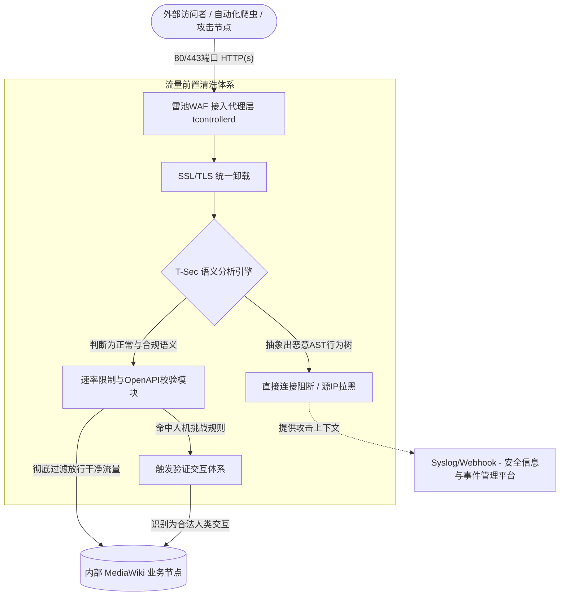

# 雷池 WAF 与 MediaWiki 深度安全集成架构与实战指南

在企业数字化转型与协作日益紧密的当下，MediaWiki作为全球应用最为广泛的知识管理平台，其安全性直接关系到核心数据资产的完整性。由于其具备高度开放的编辑特性、复杂的插件以及宏大的API系统，MediaWiki频繁面临跨站脚本（XSS）、SQL注入（SQLi）及各类自动化数据爬取等严峻安全威胁。

传统的防御机制（如MediaWiki原生的 `AbuseFilter` 和 `SpamBlacklist` 插件）主要依赖PHP层面的正则表达式进行拦截。这种机制不仅在匹配复杂恶意载荷时容易被绕过（例如通过 `union/**/select` 注入），更重要的是，脏流量在被拦截前就已经消耗了大量的计算资源与数据库连接。

本文将结合开源的长亭雷池（SafeLine）WAF底层代码结构，探讨基于智能语义分析引擎的下一代网关架构如何为MediaWiki提供更高效的深度防御，以及双方如何通过API与Webhook建立自动化反制闭环。

---

## 一、 防护架构演进：从应用内部到流量边缘

现代安全理念提倡“防线前置”。雷池WAF采用了 **反向代理（Reverse Proxy）** 部署机制，这在物理和逻辑双层面将真实的MediaWiki集群与互联网隔离。通过这种模式，恶意流量不再有机会触发应用本身代码中潜在的反序列化或RCE缺陷。

通过两者的分工改变，我们可以看出接入雷池之后防护维度的变迁：

| 实施维度 | 传统MediaWiki防御 (原生插件) | 雷池WAF集成防护架构 |
| :--- | :--- | :--- |
| **接入位置** | PHP应用逻辑层触发 | 流量边缘（Nginx 反向代理层）拦截 |
| **防御消耗** | 占用PHP进程池与SQL查询 | 在毫秒级完成阻断，释放PHP集群性能 |
| **检测原理** | 三型文法（正则匹配），高回溯率 | 二型文法（CFG），AST语义树构造 |

所有来自外部的请求处理节点流转如下：

## 二、 底层检测引擎差异：正则文法与语义分析的对比

MediaWiki的防御痛点之一在于核心交互协议的复杂性。在许多技术Wiki页面中，往往包含了大量用于展示的系统代码段或SQL指令，传统的正则匹配常常无法区分“文本展示”与“实际攻击”。

### 1. 语法树分析的优势
在雷池项目的底层代码中，`yanshi/` 目录正是负责核心检测的 **T-Sec 语义分析引擎**。该引擎不局限于词汇黑名单，而是通过 C++ 模块（如 `fsa.cc`, `compiler`, `parser.y` 等）执行词法拆解和上下文无关文法（CFG）的逻辑构建。

引擎会将收到的HTTP请求从底向上构建为抽象语法树（AST）。如果这棵树被判定为对后端数据库有实质越权执行动作的结构（例如非期望的UNION联表操作），雷池将立刻拦截；反之，若判定其仅处于合法文档的内容域内，则不会干涉。由于这一过程在语法层级直接判定，它天然且高效地免疫了类似免杀混淆或是各类编码绕过。

### 2. 深度递归解码
MediaWiki的 `api.php` 处理了大量的序列化及深层编码的参数请求。而攻击者常常利用URL编码嵌套Base64来隐藏真实的利用代码。雷池在 `yanshi` 引擎内部引入了深度递归解码机制清洗输入参数。还原出原本输入后再次进入语义判断环节，将漏洞挖掘工具生成的扫描流量一网打尽。

## 三、 边界与核心联动：开放 API 驱动的信誉同步机制

防御策略不是孤立的。在多站点MediaWiki环境（Wiki Farm）下，雷池WAF极度开放的OpenAPI成为了跨组件联动的中枢。

在传统的Wiki架构下，`AbuseFilter` 检测到异常账户疯狂删改页面时，仅能在当前应用节点阻止修改。但通过编写钩子（Hook）桥接脚本，我们可直接将异常数据通知至雷池代理网关：
1. **风险触发**：MediaWiki检测到某用户产生自动化SPAM行为。
2. **边缘拦截广播**：应用后台向雷池WAF通过安全凭证调用 `/api/IPGroupAPI`。
3. **全局拉黑**：雷池提取攻击源IP（或CIDR段），将其直接加入网络边界层的封禁池中（从Nginx底层直接 `Drop` 连接），彻底掐断该源后续一切消耗性请求。

## 四、 Wasm 扩展：针对 MediaWiki API 的业务前置预审

为进一步深度分析针对Wiki的定点打击，开发者还可以在不更改雷池原生代码逻辑的前提下加载使用WebAssembly (Wasm) 插件体系。

MediaWiki大量的操作依赖于复杂的HTTP POST报文（如 `api.php?action=edit`）。由于Wasm插件能在雷池网关内以接近原生的速度执行检测，我们可开发针对性的协议逻辑：
* **Wikitext层面的前置净化**：当收到包含 `text` 参数的载荷时，利用Wasm组件先行判断是否属于针对MediaWiki解析器弱点的嵌套语法炸弹，阻止会导致后端业务发生资源穷竭的恶意大报文。
* **认证连续性保障**：前置拦截CSRF Token与Cookie指纹存在冲突的重放请求。

## 五、 抵御指纹识别与零日漏洞（0-day）的虚拟补丁防御

MediaWiki中的ResourceLoader架构（对应于 `load.php`）主要提供动态脚本加载。攻击者时常通过发送特定的试探请求来读取组件的版本信息以确立指纹环境。利用雷池WAF的**动态网页防护特性**，可以对传输的JavaScript进行实时再混淆。同时针对高危的登录入口（ `Special:UserLogin`）开启防重放随机URI映射配置，中断常见的大规模撞库工具和自动化扫描器。

此外，遇到诸如CVE-2025-6927（暴露 `BlockListPager.php` 所引发的信息泄露风险）等0-day突发漏洞时，管理员不非得立刻重启实例更新内核代码。雷池内建的自定义规则引擎允许快速实施**虚拟补丁（Virtual Patch）**。比如可设定一条高级匹配规则：一旦请求目标为 `api.php` 且 `action=query`、载体中含有 `list=blocks` 参数但无管理态验证Cookie的，直接重定向至失败页面。该特性充分抑制了紧急漏洞曝光期间的技术空窗期。

## 六、 生产环境部署建议与安全运营闭环

针对大型知识系统的可用性及管理标准，推荐的生产系统安全配置如下：

1. **部署拓扑切割**：避免在生产环境直接采用同服务器容器混放，建议将雷池 WAF 节点置于云端负载均衡/独立的高性能流量网关机器上处理SSL认证卸载与请求前过滤。在MediaWiki的源站系统防火墙中（如利用 `iptables` ），彻底封死除雷池出向节点IP以外的所有入网公网连接。
2. **日志协同分析**：雷池默认兼容基于Syslog标准投递格式。通过 `management/webserver` 将审计节点日志与拦截行为直接推送至 Wazuh 或 ELK 平台，协助安全团队复原MediaWiki被攻击的攻击时序链路。
3. **智能群防网络**：通过开启WAF自带的智能社区情报数据同步网。使本地MediaWiki能直接受惠于全网数十万雷池节点动态共享出的攻击源名单（IP威胁情报），防患于未然。

伴随着攻击技术从单一的注入向规模化逻辑滥用的演变，以语义引擎（T-Sec）配合管理调度为核心的现代化WAF接入，已成为保障内容库高可用和防御稳健体系的最优实战路径。
