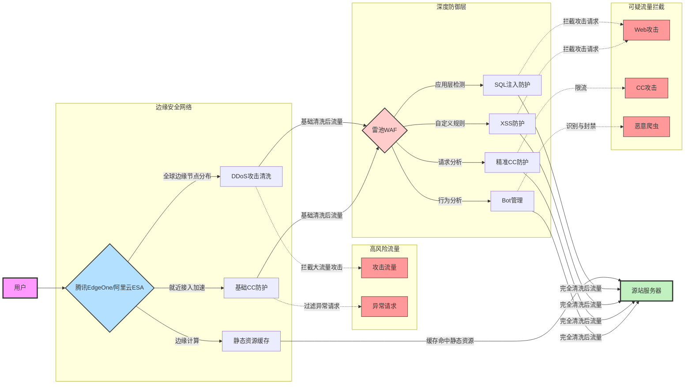

随着网络安全风险持续上升，Web应用防火墙已成为网站安全的基础组件。对个人开发者而言，开源的雷池WAF能提供企业级的安全防护，但单纯使用WAF面临几个显著挑战：

1. **DDoS防护能力有限**：源站防护无法有效应对大流量攻击
2. **性能瓶颈**：所有流量直接打到WAF宿主机，可能导致性能问题
3. **全球访问延迟**：缺乏分布式节点导致跨区域访问缓慢

将雷池WAF与腾讯云EdgeOne或阿里云ESA(边缘安全加速)结合，可有效解决上述问题。本文将详细分析这种组合的技术实现及配置要点。

## 技术架构及优势

### 技术优势

#### 安全防护层面
- **完整防护能力**：雷池WAF提供精准的应用层防护，EdgeOne/ESA负责网络层和传输层防护
- **雷池WAF的核心作用**：作为主要安全引擎，提供深度检测能力，包括SQL注入、XSS、命令执行等Web应用攻击防御
- **边缘节点的分流效果**：EdgeOne/ESA处理大流量DDoS攻击和明显异常请求，仅将合法或需深度检测的流量传递给雷池WAF

#### 技术协同方面
- **IP情报共享**：雷池WAF检测到的恶意IP可通过API推送至EdgeOne/ESA黑名单
- **请求链路追踪**：通过HTTP Headers（X-Forwarded-For、True-Client-IP等自定义header）保证真实IP透传
- **自适应安全策略**：根据攻击特征在两个系统间动态调整防护策略

## 防护策略配置重点

### 雷池WAF与边缘节点的职责明确

| 安全功能 | EdgeOne/ESA | 雷池WAF |
|---------|------------|---------|
| DDoS防护 | ✅ 主要负责 | ❌ 不负责 |
| CC防护   | ✅ 基础规则 | ✅ 精细规则 |
| Web攻击防护 | ❌ 基础/不支持 | ✅ 全面检测 |
| Bot管理  | ❌ 简单识别 | ✅ 行为分析 |
| 访问控制 | ✅ 地域/IP  | ✅ 复杂条件 |
| SSL管理  | ✅ 证书管理 | ⚠️ 可选配置 |

### 雷池WAF特有优势配置

针对EdgeOne/ESA个人版无法处理的高级威胁，雷池WAF提供了关键防护能力：

1. **应用层深度检测**：
   - 雷池WAF可以精确识别和拦截SQL注入、XSS跨站脚本等应用层攻击
   - 支持通过自定义规则检测特定业务场景下的参数异常

2. **基于上下文的行为分析**：
   - 对访问者行为进行统计分析，如登录尝试频率监测
   - 针对异常行为实施临时封禁等措施，有效防范暴力破解

3. **针对复杂业务逻辑的防护**：
   - 支持针对敏感操作的多维度验证
   - 可自定义识别缺少安全令牌的请求，增强敏感接口保护

## 性能优化配置

### 静态资源处理策略

在EdgeOne/ESA侧配置缓存规则是关键优化点，这样可以：

- 减轻雷池WAF的处理压力
- 提高静态资源访问速度
- 降低源站带宽消耗

最佳实践是根据文件类型设置合理的缓存时间，如图片、CSS、JavaScript及字体文件等。

### 雷池WAF规则优化

针对已被EdgeOne/ESA缓存的静态资源，可在雷池WAF中配置绕过规则，进一步提升性能。常见做法是对静态资源路径和文件类型进行规则匹配，让这类请求跳过不必要的安全检查。

## 实际部署注意事项

### 真实IP获取配置

在反向代理架构中，雷池WAF必须能获取客户端真实IP，这对精准防护至关重要：

- 需正确配置EdgeOne或ESA的HTTP头部传递
- 确认边缘节点的所有IP段已添加到信任列表中

### 源站保护配置

防止攻击者绕过EdgeOne/ESA直接访问源站是安全架构中的关键环节。核心做法是：

- 在防火墙层面仅允许已知的EdgeOne/ESA IP段访问Web服务端口
- 严格限制开放端口，仅保留必要服务
- 考虑使用自定义端口作为回源端口，增加额外安全层

## 监控与故障排除

### 日志关联分析

建立EdgeOne/ESA与雷池WAF之间的日志关联机制可实现全链路分析：

- 确保两个系统能够记录相同的请求标识符
- 记录关键字段如客户端IP、时间戳、请求特征等
- 利用日志分析工具将边缘防护与应用层防护数据整合分析

### 性能监控指标

关注以下关键指标可帮助评估和优化防护系统：

- 雷池WAF侧：请求处理延迟、规则匹配时间、资源使用率等
- EdgeOne/ESA侧：源站响应时间、缓存命中率、回源流量比例等

## 总结

雷池WAF与EdgeOne/ESA的结合为个人开发者提供了技术上的最佳选择，能够以较低成本实现企业级的安全防护。这种架构充分发挥了雷池WAF在应用层安全防护的优势，同时利用边缘节点解决了DDoS防护、性能瓶颈和全球访问延迟等问题。

在实际部署过程中，正确配置真实IP透传、规则联动机制和源站保护是确保系统正常运行的关键。通过本文提供的配置思路可以快速搭建一套高效、安全、经济的Web应用防护系统。